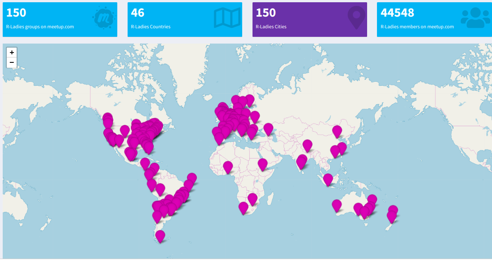
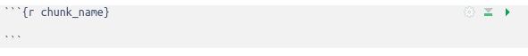
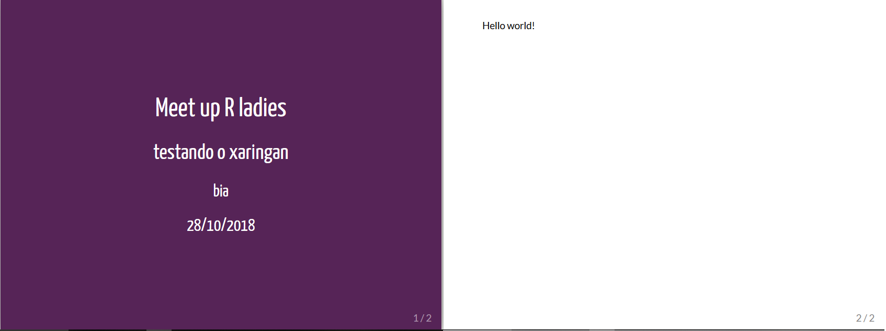
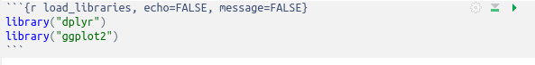
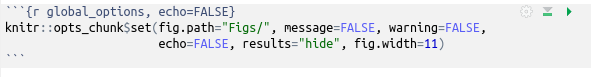

```{r setup, include=FALSE}
knitr::opts_chunk$set(echo = TRUE, fig.align = "center")
```


class: split-two with-border
.column.bg-main1[.content[
# Instrutoras
## Beatriz Milz

```{r echo=FALSE, out.width="100%"}
knitr::include_graphics("img/foto_bia.jpg")
```
]]
.column.bg-main2[.content[

- Doutoranda em Ciência Ambiental no PROCAM/IEE/USP. 

- Co-organizadora do R-Ladies São Paulo.

- Assessora Editorial na <a href="http://scielo.br/asoc">Revista Ambiente e Sociedade</a> 
- Bacharel em Gestão Ambiental (EACH/USP).

- Mestre em Ciências no PPG-Análise Ambiental Integrada (UNIFESP/Diadema). 

- Email: <a href="mailto:beatriz.milz@hotmail.com">beatriz.milz@hotmail.com</a>

- Página: https://beatrizmilz.github.io/

- Github: <a href="http://github.com/beatrizmilz">@beatrizmilz</a> 

- Twitter: <a href="http://twitter.com/beatrizmilz">@BeaMilz</a> 

]]


---
class: split-two with-border
.column.bg-main1[.content[
# Instrutoras
## Haydee Svab

```{r echo=FALSE, out.width="100%"}

```
]]
.column.bg-main2[.content[

- É pesquisadora em mobilidade urbana e ativista pela equidade de gênero e pelo direito à cidade. 
- Atualmente é consultora do Banco Mundial, CEO da ASK-AR (consultoria em análise de dados), membro do Conselho Deliberativo da AEAMESP (Associação dos Engenheiros e Arquitetos de Metrô) e da comunidade Transparência Hacker.

- É co-fundadora dos grupos RLadies - São Paulo, do PoliGNU (Grupo de Estudos de Software Livre da Poli-USP) e da PoliGen (Grupo de Estudos de Gênero da Poli-USP).

- Cursa doutorado em Smart Cities pelo IME-USP, é mestra em Engenharia e Planejamento de Transportes (Poli-USP) e especialista em Democracia Participativa, Repúblicas e Movimentos Sociais (UFMG) além de ter formação em Engenharia Civil/Arquitetura pela USP (Programa Poli-FAU).

]]

---
class: middle
# Cronograma 

1 - O que é o R-Ladies?

2 - Introdução sobre a linguagem de marcação markdown e sobre arquivos do tipo RMarkdown.

3 - Como criar uma apresentação utilizando o pacote Xaringan. 

4 - Hospedagem da apresentação utilizando o Github Pages.

---


class:  center, middle
# O que é o R-Ladies?

R-Ladies é uma organização mundial que promove a diversidade de gênero na comunidade da linguagem R.
R-Ladies São Paulo integra, orgulhosamente, a organização R-Ladies Global, em São Paulo.

## Como?

Através de meetups e mentorias em um ambiente seguro e amigável.

Nosso principal objetivo é promover a linguagem computacional estatística R compartilhando conhecimento, assim, quem tiver interesse na linguagem será bem-vinda, independente do nível de conhecimento. 


Fonte: [About us - R-Ladies](https://rladies.org/about-us/), [Meetup R-Ladies São Paulo](https://www.meetup.com/R-Ladies-Sao-Paulo/)

---
class:   center, middle
## Para quem?
Nosso principal público-alvo são as pessoas que se identificam com o gênero feminino, portanto, mulheres cis, mulheres trans, bem como pessoas não-binárias e queer.

## Missão

Como uma iniciativa de diversidade, a missão das R-Ladies é alcançar uma representação proporcional de pessoas de gêneros atualmente sub-representados na comunidade R, incentivando, inspirando e caacitando-as.


Fonte: [About us - R-Ladies](https://rladies.org/about-us/), [Meetup R-Ladies São Paulo](https://www.meetup.com/R-Ladies-Sao-Paulo/)

---
class:   center, middle
## Como o R-Ladies começou?
```{r echo=FALSE, fig.align='center', out.width="20%"}
knitr::include_graphics("img/gabriela.jpeg")
```


**[Gabriela de Queiroz](https://github.com/gdequeiroz)** fundou o R-Ladies no dia **1 de outubro de 2012**. Ela queria retribuir à comunidade depois de ir a vários encontros e aprender muito de graça. O primeiro encontro R-Ladies foi realizado em ** San Francisco, Califórnia (Estados Unidos) **. Nos anos seguintes, mais capítulos do R-Ladies começaram em todo o mundo.

Fonte: [About us - R-Ladies](https://rladies.org/about-us/history/)


---
class:center, middle

```{r echo=FALSE, out.width="100%"}

```


Fonte: [R-Ladies Shiny App](https://gqueiroz.shinyapps.io/rshinylady/)  (13/04/2019)
---
class:   center, middle
## Código de conduta


O R-Ladies dedica-se a proporcionar uma experiência livre de assédio para todos. Não toleramos nenhuma forma de assédio aos participantes.


[Código de conduta - R-Ladies](https://github.com/rladies/starter-kit/wiki/Code-of-Conduct#portuguese)


---
## R-Ladies no Brasil:
```{r include=FALSE}
rladies_br <- data.frame(
city = c("Florianópolis", "Salvador", "Niterói", "Curitiba", "Belo Horizonte",
         "São Paulo",	"Porto Alegre", "Natal",	"Americana",	"Rio de Janeiro"),
dt_created = c("2019-04-07", "2018-07-23", "2018-06-04", "2018-05-29", "2018-04-20",
               "2018-02-10", "2017-10-30", "2017-09-25", "2017-06-24", "2017-02-27"
               ),
members = c(22, 114, 289, 151, 509,
            343, 218, 135, 28, 394)
)

```
Atualizado em: 13/04/2019. Fonte: [R-Ladies Shiny App](https://gqueiroz.shinyapps.io/rshinylady/) 

```{r echo=FALSE}
DT::datatable(rladies_br, autoHideNavigation = TRUE)
```

---
class:  center, middle
## Como saber mais?

[Meetup](https://www.meetup.com/pt-BR/R-Ladies-Sao-Paulo)

Twitter: [@RLadiesGlobal](https://twitter.com/rladiesglobal), [@RLadiesSaoPaulo](https://twitter.com/RLadiesSaoPaulo)

Instagram: [@RLadiesSaoPaulo](http://instagram.com/RLadiesSaoPaulo)

Facebook: [@RLadiesSaoPaulo](http://facebook.com/RLadiesSaoPaulo)

Website: [https://rladies.org/](https://rladies.org/)

R-Ladies LATAM Blog (Latin America) - Em breve!


[R-Ladies - How do get involved](https://rladies.org/about-us/help/)

---
class: middle, center

# Introdução sobre a linguagem de marcação markdown e arquivos do tipo RMarkdown.

---
class: middle
## Por que apresentações são importantes? 


```{r echo=FALSE, out.width="100%"}
knitr::include_graphics("img/data-science.png")
```

Fonte: http://r4ds.had.co.nz/

- Uma das formas de comunicar os resultados!
- O que vocês utilizam em apresentações?

---
class: middle
## Formas de criar apresentações no R:

* Pacote xaringan - Utiliza a biblioteca remark.js do JavaScript para criação de apresentações; Utiliza RMarkdown.

* Outros: 

      * output: **beamer_presentation** ->  beamer (pdf)
      
      * output: **ioslides_presentation** -> ioslides (HTML) 
      
      * output: **slidy_presentation** ->  slidy (HTML)
      
      Obs: para separar entre um slide e outro, usar três *


- Hoje iremos praticar como criar uma apresentação utilizando o R e o pacote Xaringan. 


---
class: middle

## Rmarkdown
* É um tipo de arquivo que suporta códigos em R, texto, markdown e outros formatos.

* Apresenta os seus códigos, o resultado, e também os seus comentários.

* Arquivos **.Rmd** são reprodutíveis.

* São interessantes para trabalhar em equipe, para comunicar seus resultados, e para desenvolver seus códigos em R.

* O markdown é uma linguagem de marcação simples. 

* [Rmarkdown Cheatsheet](http://www.rstudio.com/wp-content/uploads/2016/03/rmarkdown-cheatsheet-2.0.pdf)

* Apresentação Yihui: [Advanced R Markdown](https://slides.yihui.name/2017-rstudio-conf-rmarkdown-Yihui-Xie.html)

* Dica de livro: [R Markdown: The Definitive Guide](https://bookdown.org/yihui/rmarkdown/)

---
class: middle

## Rmarkdown
* Possibilita exportar diferentes tipos de arquivos.

```{r echo=FALSE, fig.align='center', out.width="50%"}
knitr::include_graphics("img/markdown.png")
```

---
class: middle
## Markdown

* O Rmarkdown utiliza a linguagem de marcação Markdown.

* O markdown é uma linguagem de marcação simples. 

* [Rmarkdown Cheatsheet 2.0](http://www.rstudio.com/wp-content/uploads/2016/03/rmarkdown-cheatsheet-2.0.pdf) e [Rmarkdown Cheatsheet](https://www.rstudio.com/wp-content/uploads/2015/02/rmarkdown-cheatsheet.pdf).

* Elaborada para ser fácil de ler, fácil de escrever.

---
## Markdown


**Negrito**: `**bold**` 

_Itálico_: `_italics_`


**Adicionar títulos**

`# Título 1`

`## Título 2`

`### Título 3` 

# Título 1
## Título 2
### Título 3

---
class: middle
## Fazendo uma lista
Você pode fazer uma lista escrevendo com hífens ou asteriscos, como a seguir:

`* negrito com asteriscos duplos`

`* itálico com underline`

`* fonte do tipo código com crase`

ou dessa forma:

`- negrito com asteriscos duplos`

`- itálico com underline`

`- fonte do tipo código com crase`

Cada um vai aparecer como:

- negrito com asteriscos duplos
- itálico com underline
- fonte do tipo código com crase

Referência: [SW Carpentry](https://swcarpentry.github.io/r-novice-gapminder/15-knitr-markdown/index.html)


---
class: middle
## Fazendo uma lista enumerada
Você pode fazer uma lista numerada usando somente números. Você pode usar o mesmo número quantas vezes quiser: 

`1. negrito com asteriscos duplos`

`1. itálico com underline`

`1. fonte do tipo código com crase`

Isso irá aparecer como:

1. negrito com asteriscos duplos
1. itálico com underline
1. fonte do tipo código com crase


Referência: [SW Carpentry](https://swcarpentry.github.io/r-novice-gapminder/15-knitr-markdown/index.html)

---
class: middle
## Mais de Markdown

Você pode fazer um hiperlink dessa forma: `[**texto para mostrar**](http://the-web-page.com)`.

Você pode incluir arquivo de imagem dessa forma: ``

Se você sabe como escrever equações em LaTeX, ficará feliz em saber que pode usar `$$` para inserir equações matemáticas, como: 

```{r}
# $$y = \mu + \sum_{i=1}^p \beta_i x_i + \epsilon$$
```


$$y = \mu + \sum_{i=1}^p \beta_i x_i + \epsilon$$

Referência: [SW Carpentry](https://swcarpentry.github.io/r-novice-gapminder/15-knitr-markdown/index.html)

---
class: middle, center
## Mais sobre Markdown:
Consulte a [Cheatsheet](https://www.rstudio.com/wp-content/uploads/2015/02/rmarkdown-cheatsheet.pdf)!


---
class: middle, center

# Como criar uma apresentação utilizando o pacote Xaringan

---
class: middle
## Introdução sobre o Xaringan

- O xaringan é um pacote do R para criar apresentações usando o  [remark.js](http://remarkjs.com) através do Rmarkdown.

```{r echo=FALSE, out.width="30%"}
knitr::include_graphics("img/xaringan.PNG")
```

- Como pronuncia Xaringan? Veja a [resposta do autor do pacote](https://yihui.name/en/2019/01/rstudio-conf/) e  [Video](https://naruto.fandom.com/wiki/Sharingan?jwsource=cl) (1 minuto e 04 segundos)


- Mais sobre o xaringan:

    - [Apresentação da documentação](http://slides.yihui.name/xaringan/) 
    - [Livro R Markdown (Capítulo 7)](https://bookdown.org/yihui/rmarkdown/xaringan.html)
    - [Remark.js Wiki](https://github.com/gnab/remark/wiki)
    - [Xaringan Wiki](https://github.com/yihui/xaringan/wiki)
---
class: middle
## Criador do xaringan

- O xaringan foi criado pelo [**Yihui Xie**](https://yihui.name/). Ele é desenvolvedor de software na RStudio.

- Desenvolveu os seguintes pacotes: [knitr](https://yihui.name/knitr/), [animation](https://yihui.name/animation/), [bookdown](https://bookdown.org/), [blogdown](https://github.com/rstudio/blogdown), [pagedown](https://github.com/rstudio/blogdown), [xaringan](https://slides.yihui.name/xaringan/), e [tinytex](https://yihui.name/tinytex/). 

```{r echo=FALSE}
knitr::include_graphics("img/yihui.png")
```


Thanks Yihui for this amazing package! 
---
class: middle

## Pré-requisitos:
- [R](https://www.r-project.org/)
- [RStudio](https://www.rstudio.com/)
- Pacote [Rmarkdown](https://rmarkdown.rstudio.com/) * O R instala esse pacote automaticamente quando necessário.
- Pacote [Xaringan](https://github.com/yihui/xaringan) 
- Pacote [knitr](http://yihui.name/knitr/)
- Google Chrome ou Chromium. 


---
class: middle

## Instalar o Xaringan
- Existem duas formas de instalar:

CRAN:
```{r eval=FALSE, include=TRUE}
install.packages("xaringan")
```


Github:
```{r eval=FALSE, include=TRUE}
devtools::install_github("yihui/xaringan")
```


---
class: middle

## Inicie o RSTUDIO:

```{r echo=FALSE, out.width="100%"}
knitr::include_graphics("img/0.PNG")
```

- Instale os pacotes:
```{r eval=FALSE, include=TRUE}
install.packages("rmarkdown")
install.packages("knitr")
devtools::install_github("yihui/xaringan")
```

---
class:  middle

## Crie um novo arquivo Rmarkdown:

```{r echo=FALSE, out.width="100%"}
knitr::include_graphics("img/1.PNG")
```

---
class: middle

## Selecione o template Ninja Presentation:
```{r echo=FALSE, out.width="100%"}
knitr::include_graphics("img/2.PNG")
```


* Dica: para facilitar posteriormente, crie a sua apresentação com o nome de `index.Rmd`.

---
class: middle

## Será criado um RMarkdown com o Ninja Presentation:

```{r echo=FALSE, out.width="100%"}
knitr::include_graphics("img/3.PNG")
```


---
class: middle

## yaml - metadados do documento:

- **y**et **a**nother **m**arkup **l**anguage 
- Cuidado com a **identação**
- Controla muitas das configurações do documento.

```{r echo=FALSE, out.width="100%"}
knitr::include_graphics("img/4.PNG")
```

- title: título
- subtitle: subtítulo
- author: autor
- date: data
- output: formato (Ex: html_document, pdf_document, etc). No caso do Xaringan, o output é **xaringan::moon_reader**  
   - libs_dir: pasta onde colocará bibliotecas necessárias (ex. remark-latest.min.js)


Leia também: [Output Formats - R Markdown: The Definitive Guide](https://bookdown.org/yihui/rmarkdown/output-formats.html)

---
class: middle

## Quais são os temas disponíveis?
- Depende da versão do xaringan que está usando:

```{r}
names(xaringan:::list_css())
```

Alguns exemplos de disponíveis: [xaringan themes](https://github.com/yihui/xaringan/wiki/Themes)
---
class: middle
## Colocar o tema RLadies
```{r  eval=FALSE, include=TRUE}
output:
  xaringan::moon_reader:
    css: ["rladies", "rladies-fonts"]
```
- Criado por/Made by: [Alison Presmanes Hill](https://alison.rbind.io/post/r-ladies-slides/)
* Se você entende de CSS, é possível adaptar os temas e também criá-los :)


---
class: middle
## Outro tema RLadies: Kunoichi
- É esse tema que estou usando :)

```{r  eval=FALSE, include=TRUE}
output:
  xaringan::moon_reader:
    css: [kunoichi, ninjutsu, rladies-fonts]
```

- Criado por/Made by: [Emi Tanaka](https://github.com/emitanaka/ninja-theme)

---
class: middle
## RemarkJS

- O xaringan utiliza o seguinte arquivo javascript: https://remarkjs.com/downloads/remark-latest.min.js

- Por padrão,  a apresentação só funcionará online!
- Como deixar o RemarkJS offline?

```{r}
xaringan::summon_remark() # o xaringan irá fazer o download
# da versão mais recente do remark e salvar na pasta /libs
```
O yaml deve conter as seguintes linhas: 
```{r eval=FALSE}
output:
  xaringan::moon_reader:
    chakra: libs/remark-latest.min.js
    lib_dir: libs
```

---
class: middle
## Outra dica: Encoding

Para evitar problemas de codificação, adicione o encoding no yaml:

```{r eval=FALSE}
encoding: "UTF-8"
```

Leia o texto do blog do Yihui: https://yihui.name/en/2018/11/biggest-regret-knitr/
---
## Exemplo de yaml desta apresentação
```{r eval=FALSE}
---
title: "Comunicando seus resultados: "
subtitle: "Criando apresentações com R"
author: "Beatriz Milz e Haydee Svab - R-Ladies São Paulo"
date: "20 de maio de 2019  <br> (Atualizado em: `r format(Sys.Date(), format='%d/%m/%Y')`)"
encoding: "UTF-8"
output:
  xaringan::moon_reader:
    chakra: libs/remark-latest.min.js
    css: [kunoichi, ninjutsu, rladies-fonts]
    lib_dir: libs
    nature:
      highlightStyle: github
      highlightLines: true
      countIncrementalSlides: false
---
```


---
class: middle
## Chuncks de Código R

- É um campo onde podemos inserir código de R em um arquivo Rmarkdown:

```{r echo=FALSE, fig.align='center'}

```

- É uma boa ideia dar a cada chunck um nome, pois ele podem ajudar a corrigir erros, e, se quaisquer gráficos são produzidos, os nomes dos arquivos serão baseados no nome do chunck de código que os produzirem.


---
class: middle
## Como criar um chunck de código?

```{r echo=FALSE, fig.align='center', out.width="100%"}
knitr::include_graphics("img/8.PNG")
```
 
Dica: Atalho do teclado para criar chunks:  `Ctrl + ALt + I`.


---
class: middle
## Como as coisas são compiladas?

- Quando você pressiona o botão “Knit HTML”, o documento R Markdown é processado pelo knitr e um documento Markdown é produzido (como, também, um potencial conjunto de arquivos de figuras): o código em R é executado e substituído pelo input e output; se figuras são produzidas, links para essas figuras serão incluídos.

- A seguir, os documentos Markdown e de figuras  são processados pela ferramenta pandoc, que converte o arquivo Markdown em um arquivo html, com as figuras anexadas.


```{r echo=FALSE, fig.align='center', out.width="100%"}
knitr::include_graphics("img/rmd-15-rmd_to_html_fig-1.png")
```

Referência: [SW Carpentry](https://swcarpentry.github.io/r-novice-gapminder/15-knitr-markdown/index.html)

---
class:  middle

## Exemplo do yaml:

```{r echo=FALSE, out.width="100%"}
knitr::include_graphics("img/5.PNG")
```

- Aperte o Knit e...
---
class:  middle

## Resultado:
```{r echo=FALSE, out.width="40%"}

knitr::include_graphics("img/7.PNG")
```


- O knit exportará um arquivo do tipo html.

- Agora o tema da apresentação está configurado!

- Aperte H ou ? para conferir a lista de atalhos do xaringan. 
---
class: middle
## DEU ERRO NO KNITR!

Calma! É bem comum dar erro ao compliar o arquivo pois **qualquer** código errado causa isso. Algumas coisas pra se observar:

- Yaml header - se algo estiver errado, vai dar erro ao compilar. Muito cuidado com a identação!

- Código nos chunks - teste o Run All Chunks e ver se dá erro em algum específico. Se descobrir, tente verificar o que há de errado no código (pode ser a falta de um parênteses, vírgula, entre outros).

```{r echo=FALSE, out.width="30%"}
knitr::include_graphics("https://media.giphy.com/media/j9GASQ5ocrIRicnmyq/giphy.gif")
```

---
class: middle
## Opções de chunck

Há uma variedade de opções que podem afetar como os chuncks de código são tratados.

- Use `echo=FALSE` para evitar que o próprio código apareça.

- Use `results="hide"` para evitar que qualquer resultado seja impresso.

- Use `eval=FALSE` para mostrar o código, mas ele não é avaliado.

- Use `warning=FALSE` e `message=FALSE` para ocultar qualquer messagens de avisos produzidas.

- Use `out.width` para controlar o tamanho de figuras produzidas (Ex: `out.width = "100%"`).


Assim, você pode escrever:

```{r echo=FALSE, fig.align='center'}

```
 
Referência: [SW Carpentry](https://swcarpentry.github.io/r-novice-gapminder/15-knitr-markdown/index.html)
 
---
class: middle
## Opções globais de chunck
Muitas vezes, haverá algumas opções que você irá querer repetir seu uso; para isso, você pode configurar as opções globais de chunck, como:  


```{r echo=FALSE, fig.align='center'}

```

A opção `fig.path` define onde as figuras serão salvas. A `/` é importante, pois sem ela, as figuras seriam salvas no local padrão, mas só com nomes que começam com Figs. 


Referência: [SW Carpentry](https://swcarpentry.github.io/r-novice-gapminder/15-knitr-markdown/index.html)

---
class: middle
## Código R no texto
Você pode fazer com que todo número em seu relatório seja reproduzível. 

```{r}
#Use `r e ` para um in-line code chunk . 
#O código será executado e
#substituído com o valor do resultado.

```


```{r eval=FALSE, include=TRUE}
`r code`

Ex:

`r round(3.14159265359, 2)`
```

`r round(3.14159265359, 2)`

Não deixe que esse chunck in-line seja separado através das linhas.

 

Referência: [SW Carpentry](https://swcarpentry.github.io/r-novice-gapminder/15-knitr-markdown/index.html)
---
class: middle
## Código em R no texto
Outro exemplo:
```{r eval=FALSE, include=TRUE}
# O dataframe mtcars possui `r nrow(mtcars)` carros. 
```

Exemplo: O dataframe mtcars possui `r nrow(mtcars)` carros.

---
class: middle
## Exemplo: adicionando um gráfico

- Crie um chunk, e escreva o código que você geralmente utiliza para criar um gráfico :) 

```{r message=FALSE, warning=FALSE, out.width="80%"}
library(tidyverse)
ggplot(data = mtcars, mapping = aes(x = wt, y = mpg)) + geom_point() + 
  stat_smooth(method = 'lm') + facet_grid(am ~ cyl)
```
Fonte do exemplo: http://stcorp.nl/R_course/tutorial_ggplot2.html
---
class: middle
** Exemplo: adicionando uma tabela** - Dica: Usar a função DT::datatable()
```{r}
DT::datatable(rladies_br)
```
---
class: middle
## Adicionando imagens usando o Knitr

Função: `knitr::include_graphics()`

Exemplo:
```{r  out.width = "50%"}
knitr::include_graphics("https://www.r-project.org/Rlogo.png")
```
---
class: middle
## Adicionando imagens usando Knitr: opções de Chunk 

- `out.width = "50%"` - tamanho da imagem


```{r echo=FALSE, out.width = "50%"}
knitr::include_graphics("https://www.r-project.org/Rlogo.png")
```

[Opções do KnitR](https://yihui.name/knitr/options/#chunk-options)

---
class: middle
## Adicionando imagens usando Knitr: opções de Chunk 

- **Alinhamento da figura**
- `fig.align = 'center', 'default', **'left'**,'right'` 

```{r echo=FALSE,  out.width="20%", fig.align='left'} 
knitr::include_graphics("https://www.r-project.org/Rlogo.png")
```

- `fig.align = 'center', 'default', 'left', **'right' **`

```{r echo=FALSE,  out.width="20%", fig.align='right'}
knitr::include_graphics("https://www.r-project.org/Rlogo.png")
```
---
class: middle
## Adicionando imagens usando Knitr: opções de Chunk 

- Legenda de figura 

- `fig.cap="Logo R"`


```{r echo=FALSE,  out.width="50%", fig.cap="R Logo", fig.align='center'}
knitr::include_graphics("https://www.r-project.org/Rlogo.png")
```


---
class: middle
## Preview da apresentação 

```{r eval=FALSE}
xaringan::inf_mr("index.Rmd")
```
- Post do Yihui sobre isso: https://yihui.name/en/2019/02/ultimate-inf-mr/

- Comigo não funciona com o tema Kunoichi :( 
---
## Salvar a versão em PDF

- O autor do pacote disse que a forma mais confiável é abrir no Google Chrome ou Chromium, e salvar como PDF. (Usando o navegador Chrome ou no Chromium, imprima para arquivo (Ctrl + P). Não dá certo com o Mozilla Firefox).

- Porém, existe essa função do pacote `pagedown`, que é recente e ainda será melhorada (pode não funcionar muito bem). 

- Precisa ter o Chrome instalado. 

- Comigo funciona :D

```{r eval=FALSE, include=TRUE}
remotes::install_github('rstudio/pagedown')
```


```{r eval=FALSE}
pagedown::chrome_print("index.html")
```


Referência: [Apresentação do Yihui na RStudio Conf 2019: pagedown - Creating beautiful PDFs with R Markdown and CSS](https://resources.rstudio.com/rstudio-conf-2019/pagedown-creating-beautiful-pdfs-with-r-markdown-and-css)


---

class: middle, center

# Hospedagem da apresentação utilizando o Github Pages.
---
class: middle
## Compartilhando a apresentação

- Já vimos que é possível exportar um PDF;

- O formato que utilizamos para exportar uma apresentação elaborada com o xaringan é **.html**. Para isso, é necessário apertar o botão Knit (mostrado anteriormente).

- O knit gera um arquivo .html -> porém para que ele funcione, depende de outros arquivos locais (salvos na pasta do projeto).


- É possível hospedar o seu arquivo de apresentação em sites como o [Github Pages](https://github.com/) e [Netlify](https://www.netlify.com/).

---
class: middle
## Passo a passo: Como hospedagem da apresentação utilizando o Github Pages?


1) Crie uma conta gratuita no github: https://github.com/

2) Na sua conta do github, crie um novo repositório (New repository)

```{r echo=FALSE, out.width = "50%"}
knitr::include_graphics("img/github1.jpg")
```


* OBS: [Esse post do @w_oliveiras](https://medium.com/trainingcenter/plano-para-estudar-git-e-github-enquanto-aprende-programa%C3%A7%C3%A3o-f5d5f986f459) é sobre como usar git e github utilizando o terminal/linha de comando e pode ajudar! 

---
## Compartilhando a apresentação via Github Pages
3) Coloque um nome e descrição no novo repositório. Deixe como público. 

```{r echo=FALSE, out.width = "100%"}
knitr::include_graphics("img/github2.jpg")
```

---
## Compartilhando a apresentação via Github Pages
4) Repositório criado! 

```{r echo=FALSE, out.width = "100%"}
knitr::include_graphics("img/github3.jpg")
```


---
## Compartilhando a apresentação via Github Pages
5) Githubpages e pasta DOCS.

- Para o github pages funcionar, você precisa adicionar o conteúdo em uma pasta chamada `docs`. Então, antes de fazer upload, no seu computador/workingdirectory/projeto, crie uma pasta com o nome `docs` e coloque todos os arquivos da sua apresentação nessa pasta.

- De preferência, a sua apresentação deve se chamar index.html (após compilado).

```{r echo=FALSE, out.width = "100%"}
knitr::include_graphics("img/pastadocs.jpg")
```


---
## Compartilhando a apresentação via Github Pages
- Área de upload do seu repositório do github (essa não é a única forma de realizar upload, também é possível através do github desktop e pelo terminal de comando).

```{r echo=FALSE, out.width = "100%"}
knitr::include_graphics("img/github4.jpg")
```


---
## Compartilhando a apresentação via Github Pages
6) Faça o upload da pasta docs INTEIRA no seu repositório do github. 

```{r echo=FALSE, out.width = "100%"}
knitr::include_graphics("img/github5.jpg")
```


---
## Compartilhando a apresentação via Github Pages
7) Coloque uma mensagem no commit, para deixar registrado que alteração foi feita.

```{r echo=FALSE, out.width = "100%"}
knitr::include_graphics("img/github6.jpg")
```

---
## Compartilhando a apresentação via Github Pages
8) No seu repositório, clique em Settings...
```{r echo=FALSE, out.width = "100%"}
knitr::include_graphics("img/github7.jpg")
```
---
## Compartilhando a apresentação via Github Pages
8) ... e na seção Github Pages, selecione **master branch /docs folder**:.

```{r echo=FALSE, out.width = "100%"}
knitr::include_graphics("img/github8.jpg")
```

**Resultado**: https://beatrizmilz.github.io/teste/ 
---
class:  center, middle
## Agora é só enviar o link das suas apresentações lindas!
Dica: Criar um URL mais curto com o [Bitly](https://bitly.com/)


```{r echo=FALSE, out.width="50%"}
knitr::include_graphics("https://media.giphy.com/media/pOTEhtq8Jv7voNl7mb/giphy.gif")
```


---
class:  middle

## Obrigada!
Apresentação elaborada com [Xaringan](https://github.com/yihui/xaringan) e [Kunoichi](https://github.com/emitanaka/ninja-theme).

Agradecimentos especiais/Special Thanks:
- [Yihui Xie](https://github.com/yihui) - Thanks for the packages, books, blogposts, videos... 
- [Bruna Wundervald](http://brunaw.com/) - Por ajudar na apresentação.
- [Julio Trecenti](https://github.com/jtrecenti), [Curso-R](https://www.curso-r.com/) e [13 aMostra de Estatística - IME  USP](https://www.ime.usp.br/~amostra/) pelo mini-curso de Rmarkdown.

